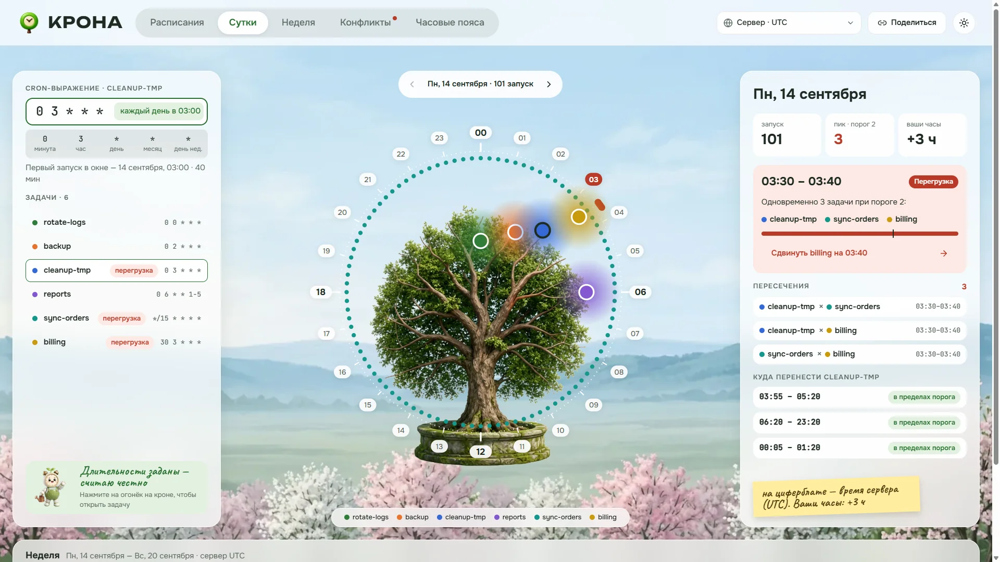
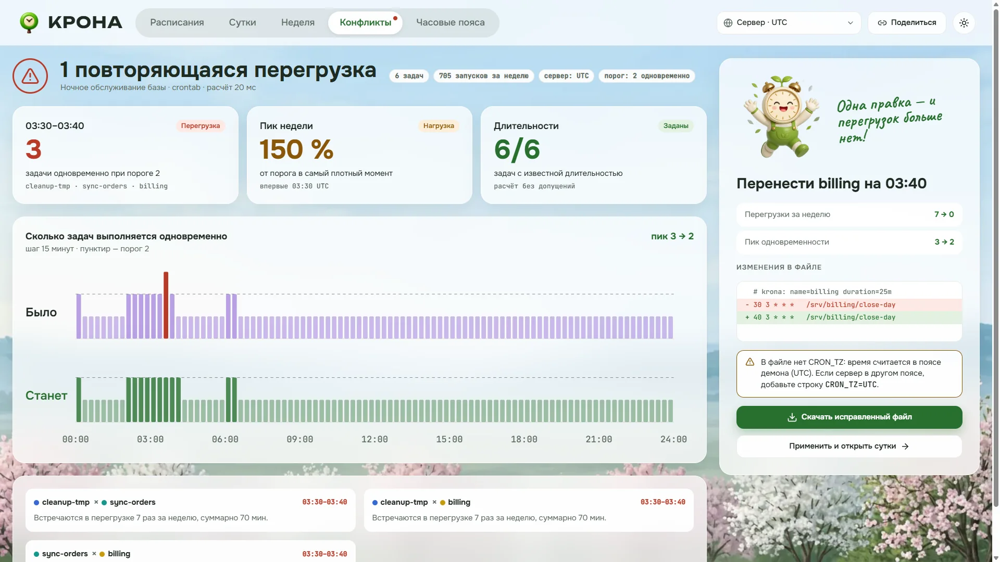
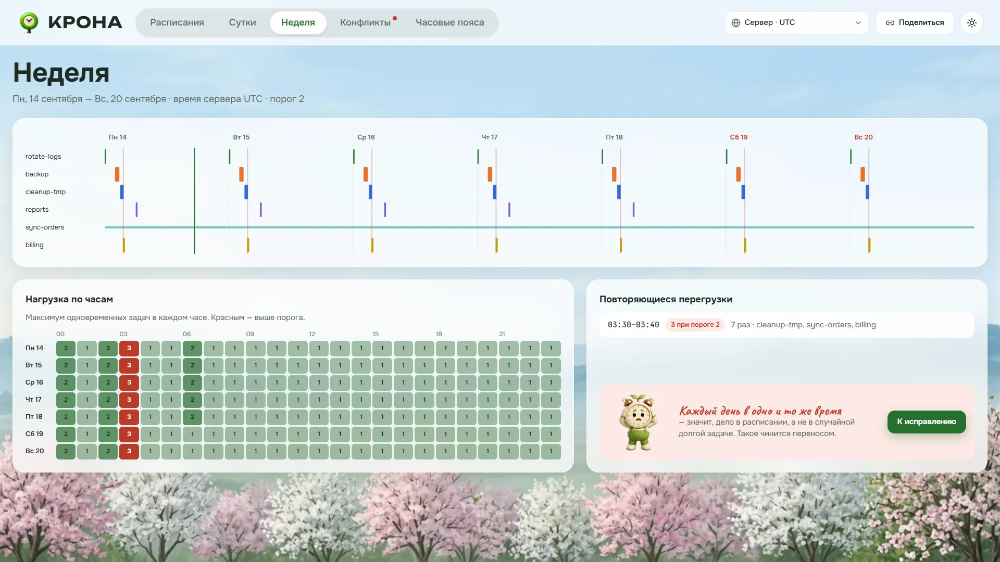
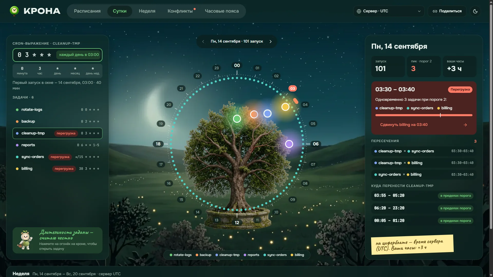
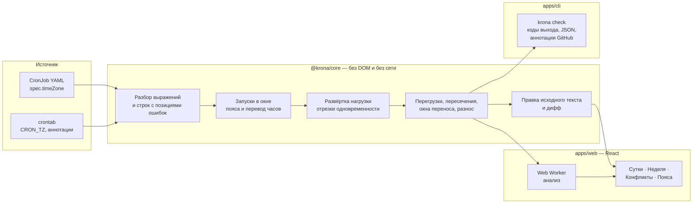

# КРОНА

Показывает расписания cron на кроне суточного дерева и находит часы, в которые задачи
мешают друг другу: перегрузки, пересечения и ловушки перевода часов, — а затем предлагает
перенос, который их убирает.



**[Открыть демо →](https://lpogosu.github.io/krona/)** — всё считается в браузере, ничего не отправляется на сервер.

## Задача

На сервере живёт десяток задач по расписанию: бэкап, очистка, закрытие дня, отчёты,
синхронизация. Каждую добавляли в разное время, и строка `0 3 * * *` ничего не говорит о
том, что ещё работает в 03:00. Проблемы всплывают ночью и выглядят как случайные:

- три тяжёлые задачи сходятся в одном окне и держат блокировки в одной базе;
- сервер живёт в UTC, а человек, писавший расписание, думал в московском времени;
- в ночь перевода часов задача на 02:30 не запускается или запускается дважды;
- пять сервисов «каждые 5 минут» стартуют в одну и ту же секунду.

КРОНА разбирает crontab или манифесты CronJob, раскладывает запуски на неделю вперёд,
считает, сколько задач работает одновременно, и показывает, где это больше порога и что с
этим сделать. Та же проверка есть в виде CLI и GitHub Action — чтобы пересечение не
доезжало до сервера.

## Как это выглядит

| | |
|---|---|
|  |  |
| **Расписания** — вставка текста или файла, живые примеры с посчитанной главной находкой | **Конфликты** — одновременность до и после исправления, дифф и готовый файл |
|  |  |
| **Неделя** — таймлайн запусков и тепловая карта нагрузки по часам | **Тёмная тема** — те же токены, режим «Тёмная» |

<p align="center"></p>

Интерфейс собран в Figma по одному референсу и перенесён в код через токены: цвета — это
коллекция переменных с режимами «Светлая» и «Тёмная», имена в `tokens.css` совпадают с
именами в макете. Состояния загрузки (скелеты и прогресс), пустые экраны, ошибки разбора с
подсветкой символов и повтором есть у каждого экрана. Контраст текста проверен по WCAG AA в
обеих темах, фокус видим с клавиатуры, огни на кроне доступны через Tab и Enter.

## Архитектура



| Путь | Что там |
|---|---|
| [`packages/core/src/cron`](packages/core/src/cron) | разбор пяти полей, макросы, описание расписания по-русски |
| [`packages/core/src/time/zone.ts`](packages/core/src/time/zone.ts) | местное время ↔ момент поверх `Intl`: провалы и повторы при переводе часов |
| [`packages/core/src/schedule/occurrences.ts`](packages/core/src/schedule/occurrences.ts) | запуски в окне по правилам cronie |
| [`packages/core/src/analysis`](packages/core/src/analysis) | нагрузка, перегрузки, пересечения, перенос, разнос частых задач |
| [`packages/core/src/fix/apply.ts`](packages/core/src/fix/apply.ts) | правка одной строки исходника и дифф |
| [`apps/cli`](apps/cli) | `krona check` для CI |
| [`apps/web`](apps/web) | интерфейс; анализ идёт в [воркере](apps/web/src/analysis/analysis.worker.ts) |
| [`examples`](examples) | те же файлы открываются в демо и проверяются тестами CLI |

## Решения и компромиссы

**Без сервера.** Разбор и анализ недели укладываются в миллисекунды (цифры ниже), поэтому
ядро — чистая библиотека, а у неё два честных потребителя: интерфейс в браузере и CLI в
CI. Отдельный API добавил бы сеть, хранение и деплой, не добавив ни одной возможности.
Демо на GitHub Pages — это тот же код, что и в контейнере, а не запись ответов.

**Перевод часов — по правилам cronie, а не «как получится».** Наивный перебор минут по
местному времени теряет запуск в весенний провал и удваивает осенью. cronie ведёт себя
иначе, и КРОНА повторяет именно его: задача с фиксированным временем (`30 2 * * *`)
весной выполняется в момент перевода, осенью — один раз; задача со звёздочкой в минуте или
часе (`0 * * * *`) весной теряет запуск, осенью срабатывает дважды. Каждый такой случай
показывается отдельно. Для CronJob используется та же модель; поведение контроллера
Kubernetes в эти минуты может отличаться, поэтому такие запуски помечены как ловушка, а не
как точный прогноз.

**`Intl` вместо библиотеки дат.** `Intl.DateTimeFormat` знает все пояса браузера и Node, в
том числе получасовые, и не тянет базу tzdata в бандл. Цена — только направление
«момент → местное время»; обратное выводится подбором смещения, а провалы и повторы видны
как 0 или 2 результата. Вызовы `Intl` дорогие, поэтому для суток без перевода часов
смещение считается один раз на сутки. Вместе с общей развёрткой нагрузки для поиска переноса
это ускорило анализ реальных примеров с 68 до 5 мс, а 300 задач — с 38 до 1,3 секунды.
Отвергнуты `cron-parser` (нет позиций ошибок для подсветки и семантики cronie при переводе
часов) и `date-fns-tz`/`luxon` (лишний вес ради того, что `Intl` уже умеет).

**Длительность — явное допущение.** cron не знает, сколько работает задача, а без этого
пересечения не посчитать. Длительность задаётся аннотацией `# krona: duration=40m` в
crontab или `krona/duration` в CronJob. Без неё берётся 5 минут, но не больше интервала
между запусками — иначе задача «каждую минуту» сама себе создавала бы перегрузку. Интерфейс
и CLI каждый раз говорят, где длительность предположена.

**Конфликт — это пересечение внутри перегрузки.** Две задачи, которые изредка идут вместе
при пороге 2, — нормальная жизнь сервера. Если показывать все пересечения, важное тонет в
шуме, поэтому пара считается конфликтом, только когда вместе с ней превышен порог.

**Перенос — только для задач с одним временем в сутки.** Для `*/15` «перенос» — это уже
другое расписание, и такой совет был бы подменой решения. Кандидаты перебираются с шагом
5 минут по тем дням, когда задача реально запускается; нагрузка остальных берётся из одной
общей развёртки. Совет проверяется полным пересчётом недели, но только для пяти ближайших
переносов: сдвиг на восемь часов не применят, если есть сдвиг на десять минут. Результат
бывает неочевидным — на примере `prod-db-01` лучше сдвинуть закрытие дня на 10 минут, чем
очистку на 55, и ядро выбирает первое.

**Разнос частых задач — жадно.** Для задач «каждые N минут» подбирается смещение
(`2-59/5`), от самой долгой к самой короткой. Полный перебор растёт как Nⁿ и уже на
десятке задач не укладывается в отклик интерфейса. Нагрузка суток хранится поминутным
массивом: все запуски начинаются в целую минуту, поэтому это точно и без пересортировки
интервалов на каждое смещение.

**Интервалы полуоткрытые.** Задача, закончившая работу в 03:40, не пересекается с той, что
стартует в 03:40. Развёртка обрабатывает окончания раньше начал в одну и ту же точку.

**Интерфейс.** Анализ идёт в Web Worker с отменой устаревших ответов: пока пользователь
правит выражение, прошлые результаты остаются на экране, а не сменяются спиннером. Маршрут
хранится в хеше, потому что Pages не отдаёт `index.html` на `/krona/day`, а роутер ради
пяти экранов не нужен. Ссылка «Поделиться» несёт проект целиком в хеше: сервера нет, а
crontab — это несколько килобайт. Графики нарисованы на SVG вручную: здесь нужны кольцо,
полосы и столбики, и тянуть ради них D3 или библиотеку графиков незачем.

## Метрики

Замер — `npm run bench`, медиана семи прогонов разбора и анализа недели, Node 22, Windows 11:

| Вход | Задач | Запусков за неделю | Время |
|---|---:|---:|---:|
| `prod-db-01.crontab` | 6 | 705 | 5,3 мс |
| `every-5-minutes.crontab` | 6 | 9 240 | 40,8 мс |
| `multi-region.yaml` | 4 | 22 | 5,1 мс |
| синтетика: 300 задач, до 40 одновременно | 300 | 76 860 | 1,3 с |

Синтетика — нарочно плохой случай: 320 эпизодов перегрузки по несколько десятков задач в
каждом, большая часть времени уходит на перебор пар внутри эпизодов. В браузере расчёт идёт
в воркере и не блокирует ввод.

Сборка интерфейса: 99 КБ JS и 18 КБ CSS в gzip, воркер анализа — 35 КБ. Иллюстрации — 0,7 МБ
WebP на все экраны и обе темы. Тесты: 104 (ядро и CLI), они же прогоняются в CI второй раз
в поясе `America/New_York`, чтобы поймать зависимость от часов раннера.

## Запуск

Интерфейс в контейнере:

```bash
make up          # http://localhost:8080
```

Разработка и проверки:

```bash
npm ci
npm run dev      # интерфейс на http://localhost:5173
make check       # ESLint, TypeScript, тесты — как в CI
make bench       # цифры из таблицы выше
```

CLI:

```bash
npm run build -w @krona/core && npm run build -w @krona/cli
node apps/cli/dist/main.js check examples/prod-db-01.crontab
```

```text
examples/prod-db-01.crontab
  rotate-logs          0 0 * * *        каждый день в 00:00 · 5 мин · 7 запусков
  backup               0 2 * * *        каждый день в 02:00 · 50 мин · 7 запусков
  cleanup-tmp          0 3 * * *        каждый день в 03:00 · 40 мин · 7 запусков
  reports              0 6 * * 1-5      по будням в 06:00 · 20 мин · 5 запусков
  sync-orders          */15 * * * *     каждые 15 минут · 10 мин · 672 запуска
  billing              30 3 * * *       каждый день в 03:30 · 25 мин · 7 запусков
  перегрузка 03:30–03:40 UTC, 7 раз: 3 при пороге 2 (cleanup-tmp, sync-orders, billing)
  совет: перенести billing на 03:40 (+10 мин) — перегрузок останется 0
  совет: перенести cleanup-tmp на 03:55 (+55 мин) — перегрузок останется 0
```

Коды выхода: `0` — чисто, `1` — перегрузки или наложение запусков одной задачи, `2` —
строка не разобрана. Параметры: `--tz`, `--threshold`, `--days`, `--from`, `--system`
(формат `/etc/crontab`), `--format json`.

В GitHub Actions:

```yaml
- uses: lpogosu/krona@main
  with:
    files: deploy/crontab k8s/cronjobs.yaml
    timezone: UTC
    threshold: '2'
```

Проблемные строки подсвечиваются аннотациями прямо в пулл-реквесте.

## Ограничения

- Поддерживается стандартный пятипольный cron и макросы `@daily` и подобные. Расширения
  Quartz (`L`, `W`, `#`, секунды) и `@reboot` не разбираются — последний не привязан ко времени.
- Окно анализа — неделя. Задачи «первого числа» или «в январе» видны, только если это
  число попадает в окно; начало окна выбирается на экране суток.
- Длительность — оценка из аннотации, а не измерение. Фактическое время работы КРОНА не
  собирает.

## Лицензия

[MIT](LICENSE)
